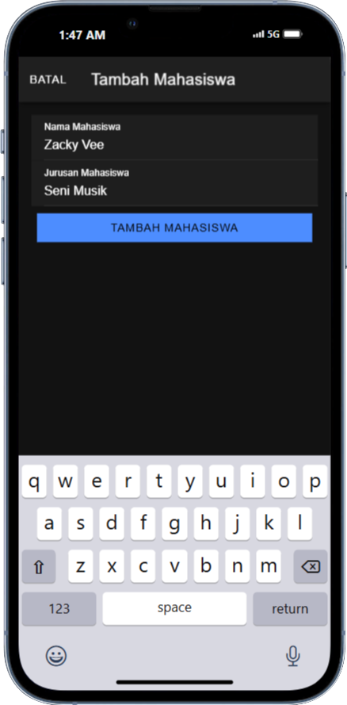
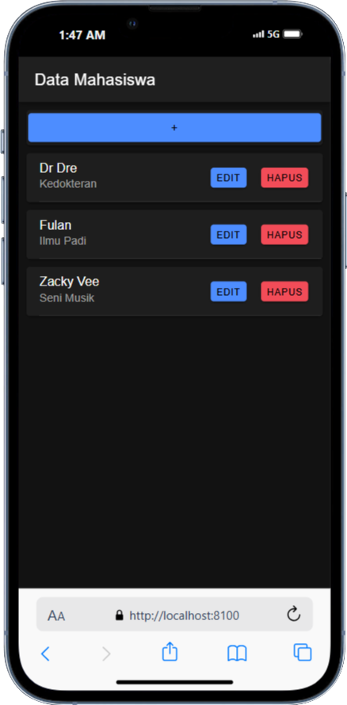
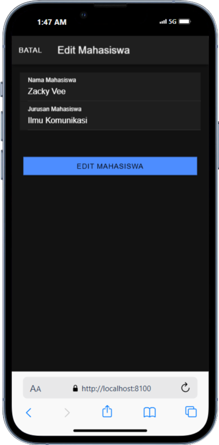
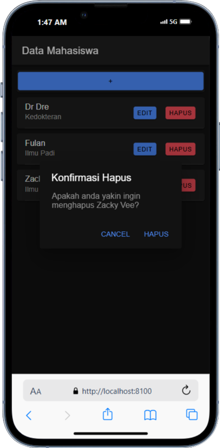

# CRUD Mahasiswa

- Nama : Fawwaz Afkar Muzakky
- NIM : H1D022067
- Shift : C
  
## Struktur

- `src/app/service/api.service.ts`: Berisi layanan API untuk berkomunikasi dengan backend.
- `src/app/mahasiswa/mahasiswa.page.ts`: Berisi logika utama untuk halaman mahasiswa.
- `src/app/mahasiswa/mahasiswa.page.html`: Berisi template HTML untuk halaman mahasiswa.

## Operasi CRUD

### Create Mahasiswa



1. Klik tombol `+` di halaman utama.
2. Modal untuk menambah mahasiswa akan muncul.
3. Isi nama dan jurusan mahasiswa.
4. Klik tombol `Tambah Mahasiswa`.
5. Isian data akan ditampung di variabel `nama` dan `jurusan`
6. Data akan dikirim ke endpoint `tambah.php` melalui metode `POST`.

Logicnya terjadi pada kode berikut

```typescript
tambahMahasiswa() {
  if (this.nama != '' && this.jurusan != '') {
    let data = {
      nama: this.nama,
      jurusan: this.jurusan,
    }
    this.api.tambah(data, 'tambah.php')
      .subscribe({
        next: (hasil: any) => {
          this.resetModal();
          console.log('berhasil tambah mahasiswa');
          this.getMahasiswa();
          this.modalTambah = false;
          this.modal.dismiss();
        },
        error: (err: any) => {
          console.log('gagal tambah mahasiswa');
        }
      })
  } else {
    console.log('gagal tambah mahasiswa karena masih ada data yg kosong');
  }
} 
```

### Read Mahasiswa



1. Data mahasiswa akan ditampilkan saat halaman dimuat.
2. Data diambil dari endpoint tampil.php melalui metode GET.

Logicnya terjadi pada kode berikut

```typescript
getMahasiswa() {
  this.api.tampil('tampil.php').subscribe({
    next: (res: any) => {
      console.log('sukses', res);
      this.dataMahasiswa = res;
    },
    error: (err: any) => {
      console.log(err);
    },
  });
}
```

### Update Mahasiswa



1. Klik tombol Edit pada salah satu data mahasiswa.
2. Modal untuk mengedit mahasiswa akan muncul.
3. Ubah data yang diperlukan.
4. Klik tombol Edit Mahasiswa.
5. Data akan dikirim ke endpoint edit.php melalui metode PUT.

Logicnya terjadi pada kode berikut

```typescript
editMahasiswa() {
  let data = {
    id: this.id,
    nama: this.nama,
    jurusan: this.jurusan
  }
  this.api.edit(data, 'edit.php')
    .subscribe({
      next: (hasil: any) => {
        console.log(hasil);
        this.resetModal();
        this.getMahasiswa();
        console.log('berhasil edit Mahasiswa');
        this.modalEdit = false;
        this.modal.dismiss();
      },
      error: (err: any) => {
        console.log('gagal edit Mahasiswa');
      }
    })
}
```

### Delete Mahasiswa



1. Klik tombol Hapus pada salah satu data mahasiswa.
2. Modal Konfirmasi penghapusan akan muncul.
3. Klik tombol Hapus pada konfirmasi.
4. Data dari id mahasiswa yang dipilih akan dikirim ke endpoint hapus.php melalui metode DELETE.

Logicnya terjadi pada kode berikut

```typescript
async presentDeleteConfirm(item: any) {
  const alert = await this.alert.create({
    header: 'Konfirmasi Hapus',
    message: `Apakah anda yakin ingin menghapus ${item.nama}?`,
    buttons: [
      {
        text: 'Cancel',
        role: 'cancel',
        handler: () => {
          console.log('Batal hapus data');
        },
      },
      {
        text: 'Hapus',
        role: 'destructive',
        handler: () => {
          this.hapusMahasiswa(item.id);
        },
      },
    ],
  });

  await alert.present();
}

hapusMahasiswa(id: any) {
  this.api.hapus(id, 'hapus.php?id=').subscribe({
    next: (res: any) => {
      console.log('sukses', res);
      this.getMahasiswa();
      console.log('berhasil hapus data');
    },
    error: (error: any) => {
      console.log('gagal');
    }
  })
}
```
